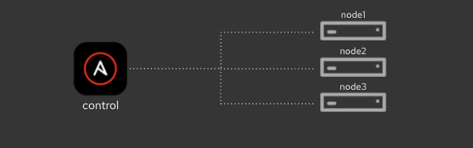

# Ansible Workshop for Beginners

Ansible is simple yet powerful IT automation for application deployment, configuration management, and orchestration that you can learn quickly. In this  section of this lab you will learn to use command-line Ansible for automation from the basics up to some more advanced concepts.

After finishing this lab you are ready to start using Ansible for your automation requirements.

## Table of Contents

- [Ansible Workshop for Beginners](#ansible-workshop-for-beginners)
  - [Table of Contents](#table-of-contents)
  - [Presentations](#presentations)
  - [Time planning](#time-planning)
  - [Lab Diagram](#lab-diagram)
  - [Command-line Ansible Exercises](#command-line-ansible-exercises)
  - [Supplemental Exercises](#supplemental-exercises)

## Presentations

The exercises are self explanatory and guide the participants through the entire lab. All concepts are explained when they are introduced.

## Time planning

The exercises themselves should take roughly 4-5 hours.

## Lab Diagram

## Command-line Ansible Exercises

* [Exercise 1.1 - Check the Prerequisites](1.1-setup/README.md)
* [Exercise 1.2 - Running Ad-hoc Commands](1.2-adhoc/README.md)
* [Exercise 1.3 - Writing Your First Playbook](1.3-playbook/README.md)
* [Exercise 1.4 - Using Variables](1.4-variables/README.md)
* [Exercise 1.5 - Conditionals, Handlers and Loops](1.5-handlers/README.md)
* [Exercise 1.6 - Templates](1.6-templates/README.md)
* [Exercise 1.7 - Roles](1.7-role/README.md)

## Supplemental Exercises

There is also a series of exercises that go above and beyond our normal workshop content.  Please check out our supplemental exercises if you want more content to learn from.

* [Supplemental Exercises](supplemental/README.md)

---
